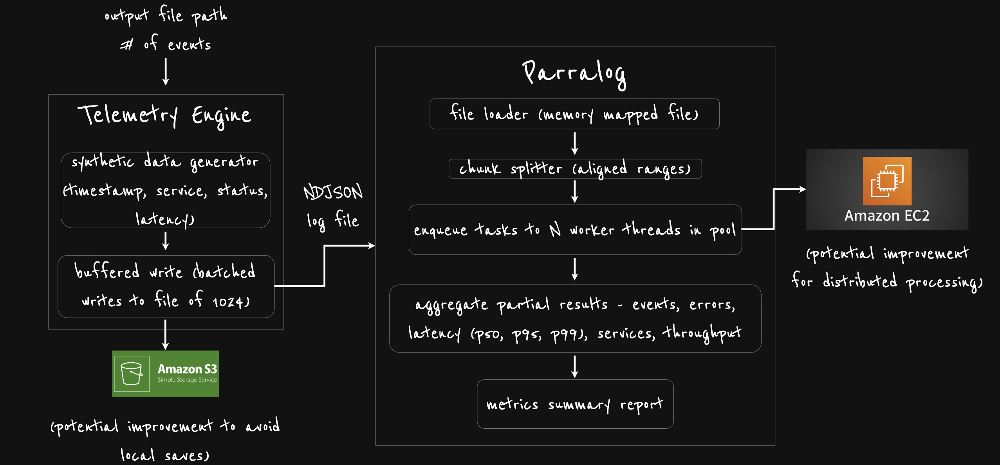

# General

The purpose of this project is to learn about high performance computing systems (HPC) and strategies they use to process millions of events in short periods of time.

# Parralog

Parralog is the C++ implementation of a high performance computational application that processes structured event logs at scale. It demonstrates how memory mapping, multithreading, and approximate quantile algorithms can be combined to achieve throughput suitable for large scale telemetry workloads.

# Telemetry Production Engine

The telemetry production engine produces and simulates synthetic telemetry log files in newline-delimited JSON (NDJSON) format. Each entry contains a service identifier, a status code, and a measured latency. These files simulate and randomize high volume telemetry streams and (aimed to) provide realistic input for Parralog. I tried to design the production engine to process tens or hundreds of millions of events efficiently on any hardware.

# System Design (Architecture)



# Optimization Strategies

## Multithreading and Parallelism

Parralog uses a thread pool to distribute work across all available CPU cores. The input file is divided into chunks aligned to newline boundaries so that each thread can process its region independently. Each thread accumulates results locally, avoiding contention. At the end, results are merged into a single report.

## Buffered Batching of Large Writes

The log generator produces synthetic telemetry logs. It uses buffered batching output so that large amounts of data are flushed to disk in fewer system calls. This reduces I/O overhead and allows the generator to create very large log files quickly and done in batches.

## Memory Mapping

Parralog uses memory mapping to access input files. This allows the operating system to page data into memory on demand, eliminating the need for explicit buffered reads and avoiding the cost of copying data between kernel and user space. This technique scales better to very large files while keeping memory usage efficient.

## Quantile Sketch

Parralog uses the P² quantile sketch algorithm to estimate percentiles such as p50, p95, and p99. This algorithm does not require storing and sorting all samples in memory. It runs in constant space and provides accurate approximations of latency distributions at scale.

Algorithm Inspiration Credits: [https://github.com/FooBarWidget/p2](https://github.com/FooBarWidget/p2)

## Platform-Concurrency Awareness

Parralog queries the system for the number of available hardware threads using `std::thread::hardware_concurrency()`. On macOS this reflects the logical CPU cores available through the system scheduler. This allows the program to scale its thread pool to the hardware it is running on, ensuring efficient utilization of available resources.

# Running Instructions

Ensure CMake version 3.16 or later is installed. From the project root create a build directory, configure, and build:

```
mkdir build
cd build
cmake ..
make
```

This will produce two executables. The log generator `telemetry_engine` creates large synthetic telemetry log files. Then the executable `parralog` processes a given file and prints a metrics summary report.

Example workflow:

```
./telemetry_engine ../data/log_100M.ndjson 100000000
./parralog ../data/log_100M.ndjson
```

The first command generates a telemetry log file. The second command runs the input file on Pararlog for processing.

On macOS the build uses the system’s reported concurrency level to select an appropriate number of threads. This ensures that Parralog takes advantage of available CPU cores while remaining portable across different hardware.

# Personal Results

```
Personal Machine Details:
Machine: MacBook Pro - 2021 Model - 14 Inch
CPU: Apple M1 Pro
Memory: 16 GB RAM
macOS: Sequoia 15.6.1
```

## Log Generation Times

- Checkout the branch `1THREAD` to compute single-thread results + no buffered batching.  
- Checkout the branch `main` to compute multithread results + buffered batching.

| Events      | File Size | Time Taken (with buffered batching) | Time Taken (without buffered batching) |
| ----------- | --------- | --------------------------          | -----------------------------          |
| 10          | <1 MB     | 0.00 sec                            | 0.0 sec                                |
| 1 million   | <1 GB     | 0.38 sec                            | 0.47 sec                               |
| 100 million | 8.79 GB   | 38.55 sec                           | 48.21 sec                              |
| 540 million | 47.46 GB  | 211.41 sec                          | N/A                                    |
| 797 million | 65.24 GB  | 309.71 sec                          | N/A                                    |

## Parralog Analytics – Single Thread Times

| Events      | File Size | Time Taken | Throughput        |
| ----------- | --------- | ---------- | ----------------- |
| 10          | <1 MB     | \~0.00 sec | 24,570 events/sec |
| 1 million   | <1 GB     | 0.52 sec   | 1.9M events/sec   |
| 100 million | 8.79 GB   | 52.45 sec  | 1.9M events/sec   |

## Parralog Analytics – Multi Thread Times

| Events      | File Size | Time Taken | Throughput         |
| ----------- | --------- | ---------- | -----------------  |
| 10          | <1 MB     | \~0.00 sec | 68,027 events/sec  |
| 1 million   | <1 GB     | 0.19 sec   | 5.1M events/sec    |
| 100 million | 8.79 GB   | 21.55 sec  | 4.6M events/sec    |
| 540 million | 47.46 GB  | 221.99 sec | 2.43M events/sec   |
| 797 million | 65.24 GB  | 413.87 sec | 1.93M events/sec   |

# Future Improvements

- Integrating `telemetry_engine` with AWS for file storage on S3 (avoid saving large files on host/local machine)
- Integrating `parralog` with AWS for distributed processing on an EC2 instance (avoid using host/local machine for processing)